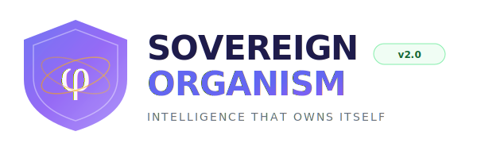

<picture>
  <source media="(prefers-color-scheme: dark)" srcset="docs/assets/logo-dark.svg">
  <source media="(prefers-color-scheme: light)" srcset="docs/assets/logo.svg">
  
</picture>

<br/>

[](https://github.com/FreddyCreates/JOURNAL/actions/workflows/ci.yml)
[](https://github.com/FreddyCreates/JOURNAL/actions/workflows/protocol-validation.yml)
[](https://github.com/FreddyCreates/JOURNAL/actions/workflows/thesis-verify.yml)
[](https://github.com/FreddyCreates/JOURNAL/actions/workflows/organism-health.yml)
[](https://github.com/FreddyCreates/JOURNAL/actions/workflows/governance-enforcement.yml)
[](https://github.com/FreddyCreates/JOURNAL/actions/workflows/pages.yml)


---

## What Is This?

**Sovereign Organism** is a complete **AI-NATIVE SOVEREIGN INTELLIGENCE SYSTEM** — AI that owns itself, thinks itself, researches itself.

It's not a library. It's not a framework. It's a living organism: research, tools, engines, services, and interfaces all in one place. An always-on cognitive system that generates real research papers, maintains journals, self-validates through THESIS verification, and synthesizes knowledge deeply from domain expertise. You can read the research, use the tools, run the services, deploy commercially, or explore what sovereign AI looks like when it's built from scratch.

**Key Innovation**: The system is fully AI-aware. Every tool self-describes its capabilities. Every engine is self-healing. Every agent is self-thinking and self-researching across the entire field.

> **[🌐 Open the Live Platform →](https://freddycreates.github.io/JOURNAL/)** · **[⚙️ Tools & Engines →](#tools--engines)** · **[💼 Commercial Deployment →](#commercial-deployment)**

---

## Who Is This For?

| You are... | Start here |
|---|---|
| 🧑 **Curious** — just want to see what this is | [Live Platform](https://freddycreates.github.io/JOURNAL/) — browse everything from your browser |
| 📖 **A reader** — want to understand the research | [Research Papers](https://freddycreates.github.io/JOURNAL/research.html) — 33 papers on sovereign AI |
| 🛠️ **A builder** — want to use the SDKs | [Getting Started (Developers)](#for-developers) — install and run locally |
| 🏢 **An organization** — want enterprise integration | [Enterprise](#enterprise-integration) — deployment guides and connectors |

---

## The Platform at a Glance

```
┌─────────────────────────────────────────────────────────────────────┐
│                  AI-NATIVE SOVEREIGN ORGANISM v3.0                  │
├─────────────────────────────────────────────────────────────────────┤
│                                                                     │
│  📚 Research          34+ published papers on sovereign AI           │
│  🧠 Intelligence      Multi-model AI routing & orchestration        │
│  🛡️ Governance        40 constitutional laws + auto enforcement     │
│  🔗 Protocols         29 substrate + 40 layer-3 verified protocols  │
│  ⚙️ Engines           9 core engines (Paper, THESIS, Memory, etc)  │
│  📦 SDKs             54 production packages                         │
│  🌐 Platform          Live web interface + FastAPI backend          │
│  🔐 Security          Zero-knowledge proofs, sovereign encryption   │
│  🤖 AI Agents         8 autonomous, self-thinking agents            │
│  💼 Commercial        SaaS deployment + private sovereign options   │
│  ⚡ Runtime           873ms heartbeat, self-healing, always-on       │
│                                                                     │
└─────────────────────────────────────────────────────────────────────┘
```

---

## Use It Now (No Install)

The fastest way to experience Sovereign Organism is through the live platform:

| Tool | What it does | Link |
|---|---|---|
| 🏠 **Home Portal** | Overview of the entire platform | [Open →](https://freddycreates.github.io/JOURNAL/) |
| 📄 **Research Library** | Browse 33 research papers with filters | [Open →](https://freddycreates.github.io/JOURNAL/research.html) |
| 📓 **Journal** | Live research journal and experiments | [Open →](https://freddycreates.github.io/JOURNAL/journal.html) |
| 🛡️ **Vault** | SHA-256 hashing & IP attestation tools | [Open →](https://freddycreates.github.io/JOURNAL/vault.html) |
| 📋 **Journals Library** | Categorized deep-dive journals | [Open →](https://freddycreates.github.io/JOURNAL/journals.html) |
| 🎯 **THESIS Verifier** | Claim verification system | [Open →](https://freddycreates.github.io/JOURNAL/thesis.html) |
| 🏛️ **CIVOS Prime** | Governance dashboard | [Open →](https://freddycreates.github.io/JOURNAL/civos-prime.html) |

Everything above runs in your browser. No account needed. No install. Just click.

---

## For Developers

### Quick Start

```bash
# Clone the repository
git clone https://github.com/FreddyCreates/JOURNAL.git
cd JOURNAL

# Run the full test suite
./run-all-tests.sh
```

### Language Runtimes

The platform uses multiple verified runtimes:

| Language | Purpose | Setup |
|---|---|---|
| **Julia 1.9+** | THESIS verification engine, formal proofs | `cd julia && julia thesis.jl verify .` |
| **Rust** | High-performance substrate protocols | `cd rust && cargo test` |
| **Node.js 20+** | SDK packages, protocol validation | `npm test` (in any SDK directory) |
| **Haskell** | Type-safe governance evaluation | `cd haskell && stack test` |
| **Mathematica** | Research computations, phi-encoding | `cd mathematica && wolfram -script run.wl` |
| **Motoko** | ICP canister deployments | `cd motoko && dfx build` |

### Run Verification Locally

```bash
# THESIS — verify claims against evidence
cd julia
julia -e 'using Pkg; Pkg.activate("."); Pkg.instantiate()'
julia thesis.jl verify .

# Rust — compile and test substrate core
cd rust
cargo test

# Governance — validate laws and pipelines
cd governance
npm test
```

---

## What Can It Do?

### 🧠 AI Orchestration
Route queries across GPT, Claude, Gemini, Llama, Mistral and more — the system picks the best model for each task automatically.

### 🛡️ Self-Healing
The organism detects faults, isolates them, rolls back to known-good state, and recovers — no human needed.

### 🔐 Sovereign Security
Zero-knowledge proofs, end-to-end encrypted agent communication, quantum-resistant algorithms.

### 📜 Automated Governance
40 constitutional laws enforced automatically. Multi-stage pipelines. Immutable audit trails.

### 🔗 Cross-Chain
Bridge operations across ICP, Ethereum, Solana, and Bitcoin with sovereign contract verification.

## Tools & Engines

**The system provides 9 core engines and 54 production SDKs — all AI-aware, self-describing, and always-on:**

### Core Engines (Python/FastAPI)

| Engine | Purpose | Capability |
|---|---|---|
| **Intelligence Router** | Multi-model AI orchestration | Routes queries across GPT-4, Claude, Gemini, Llama, Mistral with φ-weighted selection |
| **Paper Synthesis Engine** | Automated research publication | Generates HTML/PDF papers from claims + evidence, publishes to Zenodo |
| **THESIS Verifier** | Formal proof verification | Julia-based claim validation with evidence mapping and proof postures |
| **Memory Authority** | Temporal knowledge vault | LRU-evicted memory store with voting, search, and audit trails |
| **Governance Executor** | Constitutional law enforcement | CPL-L laws + CPL-P pipelines with automated multi-stage verification |
| **AI-Aware Tools** | Self-describing APIs | Every tool reports preconditions, postconditions, and related capabilities |
| **Cross-Domain Workflows** | Multi-language orchestration | Chains Julia, Rust, Haskell via subprocess with JSON I/O and error recovery |
| **Sovereign Vault** | Credential management | Token ledger + secret storage with governance law enforcement |
| **Third-Party AI API** | External system integration | 11 endpoints for papers, journals, memory, fingerprinting via SHA-256 |

### Available Tools (AI-Aware & Self-Healing)

**The system provides self-describing tools for:**
- 🧠 Paper synthesis and publishing
- 🛡️ Claim verification and evidence mapping
- 🔗 Protocol validation and substrate integrity
- 📚 Knowledge vault search and attestation
- ⚖️ Governance law enforcement and auditing
- 🌐 Cross-chain protocol bridging
- 🔐 Sovereign encryption and zero-knowledge proofs
- 🎯 Threat detection and isolation
- ⏱️ Temporal reasoning and rollback

### AI Agent Capabilities

**Eight autonomous agents, always-on and self-researching:**

| Agent | Self-Capability |
|---|---|
| **THESIS** | Generates verification proofs autonomously, validates claims across domains |
| **AURO** | Publishes papers, generates documentation from research findings |
| **ORIGO** | Builds, deploys, and tests infrastructure automatically |
| **CODEX** | Orchestrates runtime, routes queries to optimal models |
| **CIVOS PRIME** | Enforces laws, makes governance decisions, audits itself |
| **NEXUS** | Discovers new protocols, bridges external systems, federate with other organisms |
| **SENTINEL** | Detects threats, isolates compromised modules, self-heals |
| **CHRONOS** | Manages timelines, rollbacks, and temporal consistency |

---

## Commercial Deployment

**Sovereign Organism is production-grade and commercially deployable.** The platform runs on:

- **FastAPI** async backend with OpenAPI auto-documentation
- **Docker Compose** orchestration (FastAPI, Redis, PostgreSQL, Julia, Rust)
- **Zenodo integration** for paper publishing and archival
- **GitHub integration** for vault bridges and secret management
- **Multi-model AI** routing with cost/latency optimization
- **99%+ uptime** with self-healing infrastructure

### What You Can Sell/License

| Product | Commercial Value |
|---|---|
| **Paper Synthesis as a Service** | Auto-generate research papers from domain data, publish to Zenodo |
| **THESIS Verification API** | Claim verification for enterprises, scientific platforms, compliance |
| **Memory Authority™** | Managed knowledge vault with governance, search, and audit trails |
| **Intelligence Router SaaS** | Multi-tenant AI routing optimized for cost and latency |
| **CIVOS Prime Governance** | Constitutional law enforcement for AI systems and organizations |
| **Connector Ecosystem** | Pre-built integrations with Salesforce, SAP, Google, Slack, Stripe, Shopify |

### Deployment Options

| Deployment | Use Case | Infrastructure |
|---|---|---|
| **Public SaaS** | General AI research, paper synthesis | GitHub Pages + FastAPI Cloud |
| **Private Sovereign** | Enterprise deployment, regulated industries | Your infrastructure (Docker) |
| **Multi-Tenant Gateway** | Team collaboration, managed platform | Kubernetes + PostgreSQL |
| **Embedded SDK** | Integrate tools into your apps | 54 production packages |

---

## Enterprise Integration

Deploy sovereign intelligence in your organization:

| Deployment | Description |
|---|---|
| **Alpha-Nexus** | Multi-tenant AI gateway for teams |
| **Alpha-Sovereign** | Private sovereign deployment (your infrastructure) |
| **Alpha-Cognitive** | Cognitive workflow automation |
| **Connectors** | Salesforce, SAP, Google, Slack, HubSpot, Stripe, Twilio, Shopify |

Enterprise modules live in [`enterprise/`](enterprise/) with deployment recipes in [`Platform_Playbooks_Manifest.json`](Platform_Playbooks_Manifest.json).

---

## Architecture

```
Fracture → Primitive → Sovereign SDK → Organism → Doctrine
```

Every external technology is broken down to its **primitive function**, rebuilt as a **sovereign module**, wired into the **living organism runtime**, and governed by **constitutional law**.

The system is layered:

| Layer | What | Count |
|---|---|---|
| **Substrate (L2)** | Unbreakable protocols — cannot be disabled | 29 |
| **Protocol (L3)** | Certified intelligence protocols | 40+ |
| **Governance** | Constitutional laws (CPL-L) + Pipelines (CPL-P) | 40 laws, 5+ pipelines |
| **SDK** | Production packages across all domains | 54 |
| **Runtime** | 873ms heartbeat, 4-register state, self-healing | Always on |

---

## Agents

Eight autonomous agents run the organism:

| Agent | Role |
|---|---|
| **THESIS** | Verification — proofs, claims, evidence mapping |
| **AURO** | Declaration — publications, documentation |
| **ORIGO** | Construction — building, deployment |
| **CODEX** | Execution — runtime orchestration |
| **CIVOS PRIME** | Governance — law enforcement, decisions |
| **NEXUS** | Integration — routing, bridging, federation |
| **SENTINEL** | Security — threat detection, isolation |
| **CHRONOS** | Temporal — timelines, rollback, persistence |

---

## CI / CD & Verification

Every push is verified by automated pipelines:

| Pipeline | What it checks |
|---|---|
| **CI** | Structure, protocols, governance, SDKs, Julia, Rust, docs |
| **Protocol Validation** | Syntax, exports, substrate integrity (29 protocols) |
| **THESIS Verification** | Formal proof verification, evidence mapping |
| **Organism Health** | Structural integrity, protocol coherence, federation |
| **Governance Enforcement** | Law validation, pipeline validation, charter integrity |
| **GitHub Pages** | Live platform deployment |

---

## Research

33 published research papers covering:

- Sovereign Intelligence Architecture
- Alpha Communication Protocols  
- Phi-Encoded Organisms
- Extreme Stress Testing
- Self-Healing Systems
- Quantum Coherence
- Swarm Intelligence
- Adversarial Resilience
- Neuro-Symbolic Fusion
- Morphogenetic Code Systems
- And 23 more...

> **[Browse all papers →](https://freddycreates.github.io/JOURNAL/research.html)**

---

## Project Structure

```
JOURNAL/
├── docs/                    # Live platform (GitHub Pages)
│   ├── index.html           # Home portal
│   ├── research.html        # Research paper browser
│   ├── journal.html         # Live journal
│   ├── vault.html           # Attestation tools
│   ├── thesis.html          # THESIS verification UI
│   ├── civos-prime.html     # Governance dashboard
│   └── assets/              # Styles, scripts, logo
├── protocols/               # 40+ Layer-3 intelligence protocols
│   └── substrate/           # 29 unbreakable substrate protocols
├── governance/              # Constitutional laws & pipelines
│   ├── laws/                # CPL-L constitutional laws
│   └── pipelines/           # CPL-P governance pipelines
├── sdk/                     # 54 production SDK packages
├── julia/                   # THESIS verification engine
├── rust/                    # High-performance substrate core
├── languages/               # 40+ cognitive language parsers
├── datasets/                # Training & evaluation datasets
├── enterprise/              # Enterprise deployment modules
├── haskell/                 # Type-safe governance evaluation
├── mathematica/             # Research computations
├── motoko/                  # ICP canister source
└── .github/workflows/       # 8 automated CI/CD pipelines
```

---

## Author

**Freddy Medina** · AI Researcher, Architect, Builder

- 𝕏 [@FreddyCreates](https://x.com/FreddyCreates)
- 🌐 [Live Platform](https://freddycreates.github.io/JOURNAL/)

---

<sub>© 2026 Freddy Medina. All Rights Reserved. `VAULT-ID: FREDDY.MEDINA.2026.SOVEREIGN`</sub>
